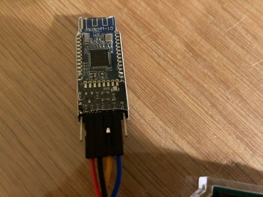
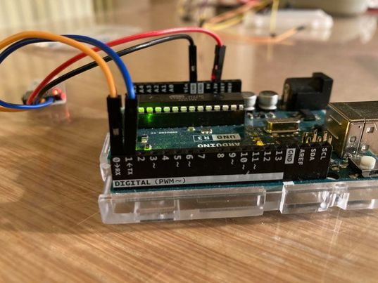
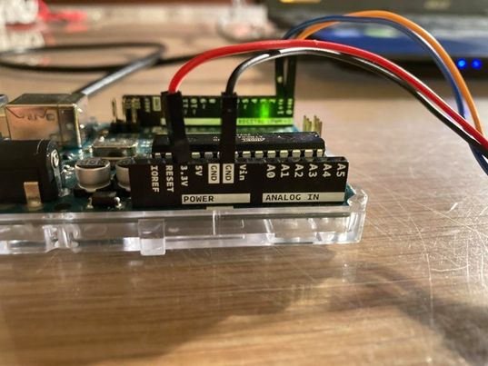

# IRRIGATION PROJECT

## Bluetooth configuration with dabble
- Connect the wires as shown

- For more information on dabble and setup:

https://thestempedia.com/docs/dabble/getting-started-with-dabble/